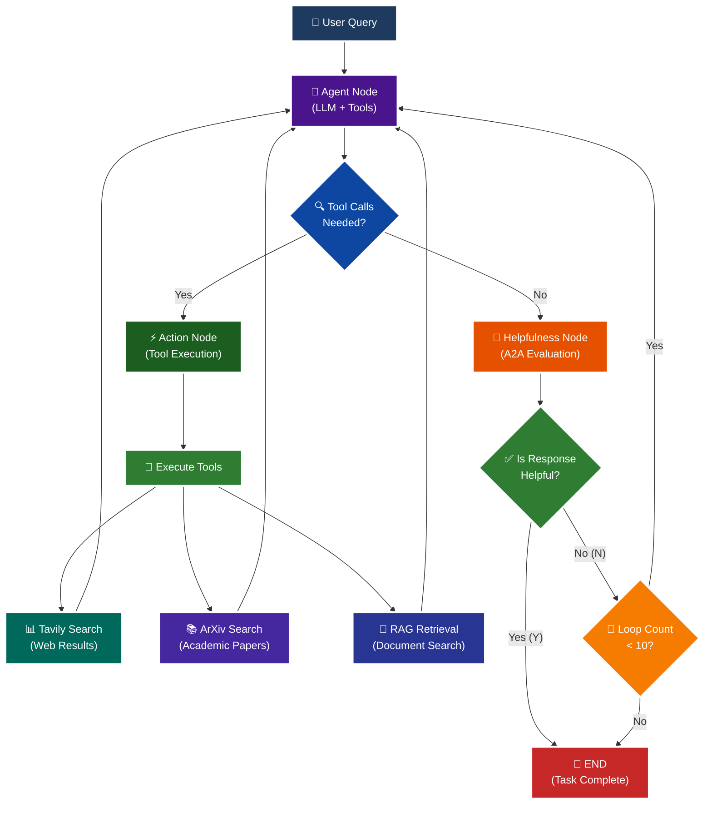

<p align = "center" draggable="false" >
</p>

## <h1 align="center" id="heading">Session 15: Build & Serve an A2A Endpoint for Our LangGraph Agent</h1>

| 📰 Session Sheet | ⏺️ Recording     | 🖼️ Slides        | 👨‍💻 Repo         | 📝 Homework      | 📁 Feedback       |
|:-----------------|:-----------------|:-----------------|:-----------------|:-----------------|:-----------------|
| [Session 15: Agent2Agent Protocol & Agent Ops](https://www.notion.so/Session-15-Agent2Agent-Protocol-Agent-Ops-26acd547af3d807c9fcdcc8864a6608a) |[Recording!](https://us02web.zoom.us/rec/share/Iz9bYK2w3p4FrtspRgMW4JKKxAlBVy1lKA-Xi99MzL7sqiLyHHVyAmyAq203HlqI.FvkopZBYLuYyCCu0) (Lyk+4@LS) | [Session 15 Slides](https://www.canva.com/design/DAG3HTQCrYs/Q2Oil7xFzz4DFEgmXdSGgg/edit?utm_content=DAG3HTQCrYs&utm_campaign=designshare&utm_medium=link2&utm_source=sharebutton) | You are here! | [Session 15 Assignment: A2A](https://forms.gle/fKTXjMJZHLReENUW9) | [AIE8 Feedback 9/16](https://forms.gle/LhGHKygFT3bfLqfS9)

# A2A Protocol Implementation with LangGraph

This session focuses on implementing the **A2A (Agent-to-Agent) Protocol** using LangGraph, featuring intelligent helpfulness evaluation and multi-turn conversation capabilities.

## 🎯 Learning Objectives

By the end of this session, you'll understand:

- **🔄 A2A Protocol**: How agents communicate and evaluate response quality

## 🧠 A2A Protocol with Helpfulness Loop

The core learning focus is this intelligent evaluation cycle:



# Build 🏗️

Complete the following tasks to understand A2A protocol implementation:

## 🚀 Quick Start

```bash
# Setup and run
./quickstart.sh
```

```bash
# Start LangGraph server
uv run python -m app
```

```bash
# Test the A2A Serer
uv run python app/test_client.py
```

### 🏗️ Activity #1:

Build a LangGraph Graph to "use" your application.

Do this by creating a Simple Agent that can make API calls to the 🤖Agent Node above through the A2A protocol. 

### ❓ Question #1:

What are the core components of an `AgentCard`?

##### ✅ Answer:

An AgentCard is like a business card for an AI agent. It tells other agents: What it does (description),What it's good at (skills like web search, paper search), Where to find it (URL), How to talk to it (protocol version, transport method), What it can handle (input/output types).It's a standardized way for agents to discover each other and communicate.

An `AgentCard` is a metadata structure in the A2A (Agent-to-Agent) protocol that describes an agent's capabilities, skills, and how to communicate with it. The core components include:

1. **`name`** - A string identifier/name for the agent (e.g., "General Purpose Agent")

2. **`description`** - A human-readable description of what the agent does and its purpose

3. **`url`** - The base URL where the agent server is accessible (e.g., "http://localhost:10000/")

4. **`version`** - A version string indicating the agent's version (e.g., "1.0.0")

5. **`capabilities`** - An `AgentCapabilities` object that specifies what the agent can do:
   - `streaming` - Whether the agent supports streaming responses
   - `push_notifications` - Whether the agent supports push notifications

6. **`skills`** - A list of `AgentSkill` objects, each describing a capability the agent possesses (web search, arxiv search, rag_search):
   - `id` - Unique identifier for the skill
   - `name` - Human-readable name of the skill
   - `description` - What the skill does
   - `tags` - Array of tags for categorization
   - `examples` - Example queries that demonstrate the skill

7. **`default_input_modes`** - Array of supported input content types (e.g., `["text", "text/plain"]`)

8. **`default_output_modes`** - Array of supported output content types

9. **`protocolVersion`** - The version of the A2A protocol being used (e.g., "0.3.0")

10. **`preferredTransport`** - The preferred communication transport method (e.g., "JSONRPC")

The AgentCard serves as a "business card" that allows other agents or clients to discover what an agent can do and how to communicate with it, enabling interoperability in multi-agent systems.

<br />

### ❓ Question #2:

Why is A2A (and other such protocols) important in your own words?

##### ✅ Answer:

A2A (Agent-to-Agent) and similar protocols are important because they solve a fundamental problem: **how do different AI agents talk to each other?**

Think of it like this: **Without a protocol, it's like having people who only speak different languages trying to work together.** Each agent would need custom code to talk to every other agent, which is messy and doesn't scale.

**With A2A protocol, it's like everyone agreeing to speak the same "common language" and follow the same "rules of conversation."**

Here's why this matters:

1. **Interoperability** - Agents built by different teams, using different tools (OpenAI, Anthropic, custom models), can all communicate using the same protocol. You don't need to rewrite everything when you want agents to work together.

2. **Discovery** - Just like how you can look up a business card to see what someone does, agents can discover each other's capabilities through AgentCards. One agent can ask "What can you do?" and get a standardized answer.

3. **Modularity** - Instead of building one giant agent that does everything, you can build specialized agents (one for web search, one for documents, one for calculations) and have them collaborate. Each agent is a "specialist" that can be called upon when needed.

4. **Future-proofing** - As new agents are built, they can immediately work with existing agents if they follow the protocol. It's like USB - once the standard existed, all devices could plug in, regardless of who made them.

5. **Ecosystem growth** - When everyone follows the same protocol, it creates a marketplace of agents. You can mix and match agents from different vendors, just like how you can use apps from different developers on your phone because they all follow the same app store rules.

**In essence, A2A protocol is the "common language" that allows AI agents to form teams, collaborate, and build complex systems together - just like how HTTP allows web browsers to talk to any web server, regardless of who built them.**

<br /><br />

<details>
<summary>🚧 Advanced Build 🚧 (OPTIONAL - <i>open this section for the requirements</i>)</summary>

Use a different Agent Framework to **test** your application.

Do this by creating a Simple Agent that acts as different personas with different goals and have that Agent use your Agent through A2A. 

Example:

"You are an expert in Machine Learning, and you want to learn about what makes Kimi K2 so incredible. You are not satisfied with surface level answers, and you wish to have sources you can read to verify information."
</details>

## 📁 Implementation Details

For detailed technical documentation, file structure, and implementation guides, see:

**➡️ [app/README.md](./app/README.md)**

This contains:
- Complete file structure breakdown
- Technical implementation details
- Tool configuration guides
- Troubleshooting instructions
- Advanced customization options

# Ship 🚢

- Short demo showing running Client

# Share 🚀

- Explain the A2A protocol implementation
- Share 3 lessons learned about agent evaluation
- Discuss 3 lessons not learned (areas for improvement)

# Submitting Your Homework

## Main Homework Assignment

Follow these steps to prepare and submit your homework assignment:
1. Create a branch of your `AIE8` repo to track your changes. Example command: `git checkout -b s15-assignment`
2. Complete the activity above
3. Answer the questions above _in-line in this README.md file_
4. Record a Loom video reviewing the Simple Agent you built for Activity #1 and the results.
5. Commit, and push your changes to your `origin` repository. _NOTE: Do not merge it into your main branch._
6. Make sure to include all of the following on your Homework Submission Form:
    + The GitHub URL to the `15_A2A_LANGGRAPH` folder _on your assignment branch (not main)_
    + The URL to your Loom Video
    + Your Three Lessons Learned/Not Yet Learned
    + The URLs to any social media posts (LinkedIn, X, Discord, etc.) ⬅️ _easy Extra Credit points!_

### OPTIONAL: 🚧 Advanced Build Assignment 🚧
<details>
  <summary>(<i>Open this section for the submission instructions.</i>)</summary>

Follow these steps to prepare and submit your homework assignment:
1. Create a branch of your `AIE8` repo to track your changes. Example command: `git checkout -b s015-assignment`
2. Complete the requirements for the Advanced Build
3. Record a Loom video reviewing the agent you built and demostrating in action
4. Commit, and push your changes to your `origin` repository. _NOTE: Do not merge it into your main branch._
5. Make sure to include all of the following on your Homework Submission Form:
    + The GitHub URL to the `15_A2A_LANGGRAPH` folder _on your assignment branch (not main)_
    + The URL to your Loom Video
    + Your Three Lessons Learned/Not Yet Learned
    + The URLs to any social media posts (LinkedIn, X, Discord, etc.) ⬅️ _easy Extra Credit points!_
</details>
